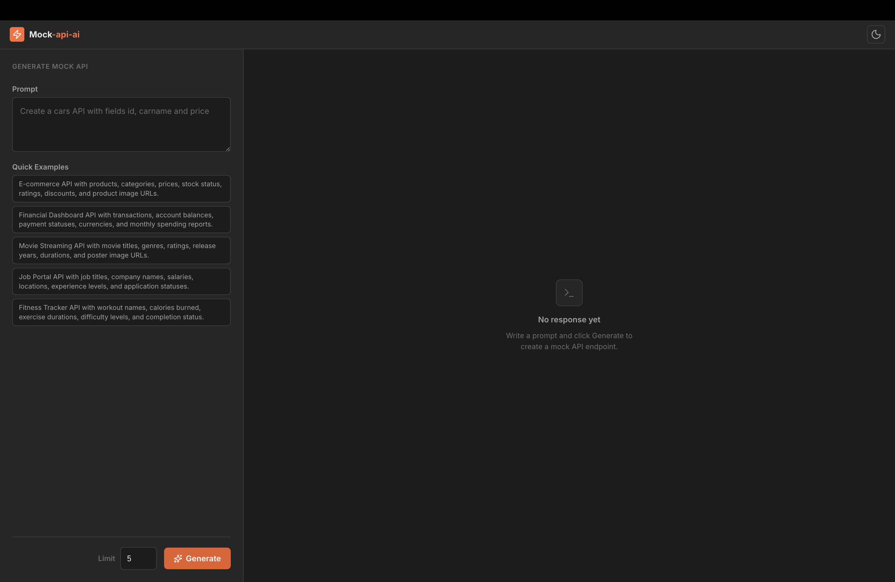
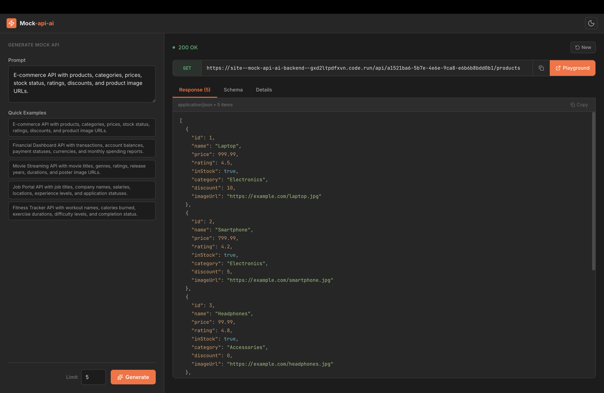
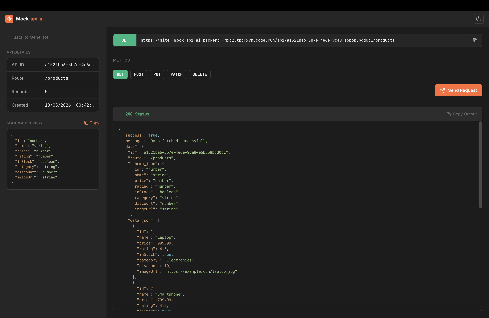

# Mock API AI Frontend

Frontend dashboard and API playground for generating, testing, and managing dynamic mock REST APIs.

---

## Live Demo

https://mock-api-ai.pages.dev/

---

## Related Repositories

- [Mock API AI Backend](https://github.com/sn0914r/mock-api-ai-backend)

---

## Features

- Generate mock REST APIs from natural language prompts
- Dynamic schema and mock data generation
- Interactive API playground for testing CRUD operations
- Real-time request body editing
- Syntax-highlighted API responses
- Copy API responses to clipboard
- Dark and light theme support
- Responsive UI

---

## Tech Stack

### Frontend

- React
- Vite
- React Router

### State Management & Data Fetching

- TanStack Query

### Forms & Validation

- React Hook Form
- Zod

### UI & Styling

- Emotion
- Bootstrap
- Lucide React
- Sonner
- React Syntax Highlighter

---

## Folder Structure

The frontend follows a feature-based modular architecture with separate modules for API generation and API playground functionality.

```txt
src/
├── app/
│   ├── App.tsx
│   ├── AppRouter.tsx
│   ├── GlobalStyles.tsx
│   ├── Providers.tsx
│   └── theme.ts
│
├── modules/
│   ├── Generate/
│   │   ├── api/
│   │   ├── components/
│   │   ├── hooks/
│   │   ├── pages/
│   │   └── Generate.router.tsx
│   │
│   └── Playground/
│       ├── api/
│       ├── components/
│       ├── hooks/
│       ├── pages/
│       └── Playground.router.tsx
│
├── shared/
│   └── Navbar/
│
├── lib/
│   ├── apiClient.ts
│   └── reactQuery.ts
│
├── utils/
│   ├── copy.ts
│   ├── getTheme.ts
│   └── normalizeRoute.ts
│
└── main.tsx
```

---

## Environment Variables

Create a `.env` file in the root directory:

```env
VITE_API_URL=http://localhost:3000
```

---

## Installation

```bash
git clone https://github.com/sn0914r/mock-api-ai-frontend.git

cd mock-api-ai-frontend

npm install

npm run dev
```

---

## Screenshots

### Generate API



### API Playground



### Playground Editor



---

## Security

- Centralized API client for handling server-side validation errors
- Form validation using React Hook Form and Zod
- Safe JSON payload parsing and validation
- Structured error handling for invalid API requests